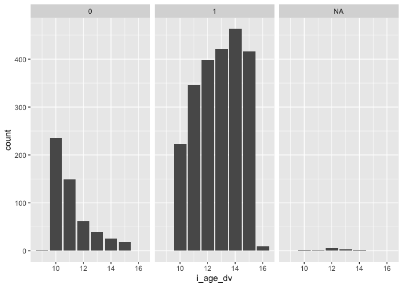
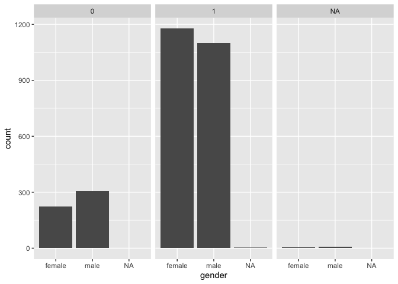

Test statistical assignment
================
Alexey Bessudnov
22 January 2020

## Introduction

Please change the author and date fields above as appropriate. Do not
change the output format. Once you have completed the assignment you
want to knit your document into a markdown document in the
“github\_document” format and then commit both the .Rmd and .md files
(and all the associated files with graphs) to your private assignment
repository on Github.

## Reading data (40 points)

First, we need to read the data into R. For this assignment, I ask you
to use data from the youth self-completion questionnaire (completed by
children between 10 and 15 years old) from Wave 9 of the Understanding
Society. It is one of the files you have downloaded as part of SN6614
from the UK Data Service. To help you find and understand this file you
will need the following documents:

1)  The Understanding Society Waves 1-9 User Guide:
    <https://www.understandingsociety.ac.uk/sites/default/files/downloads/documentation/mainstage/user-guides/mainstage-user-guide.pdf>
2)  The youth self-completion questionnaire from Wave 9:
    <https://www.understandingsociety.ac.uk/sites/default/files/downloads/documentation/mainstage/questionnaire/wave-9/w9-gb-youth-self-completion-questionnaire.pdf>
3)  The codebook for the file:
    <https://www.understandingsociety.ac.uk/documentation/mainstage/dataset-documentation/datafile/youth/wave/9>

<!-- end list -->

``` r
library(tidyverse)
```

    ## ── Attaching packages ─────────────────────────────────────────────────────────────────────────────── tidyverse 1.3.0 ──

    ## ✓ ggplot2 3.2.1     ✓ purrr   0.3.3
    ## ✓ tibble  2.1.3     ✓ dplyr   0.8.3
    ## ✓ tidyr   1.0.0     ✓ stringr 1.4.0
    ## ✓ readr   1.3.1     ✓ forcats 0.4.0

    ## ── Conflicts ────────────────────────────────────────────────────────────────────────────────── tidyverse_conflicts() ──
    ## x dplyr::filter() masks stats::filter()
    ## x dplyr::lag()    masks stats::lag()

``` r
# This attaches the tidyverse package. If you get an error here you need to install the package first. 

getwd()
```

    ## [1] "/Users/helenretzlaff/Documents/Data 3/datan3_2020/test-assignment-Helenclara"

``` r
Data <- read_tsv("/Users/helenretzlaff/Documents/Data 3/datan3_2020/data/UKDA-6614-tab/tab/ukhls_w9/i_youth.tab")
```

    ## Parsed with column specification:
    ## cols(
    ##   .default = col_double()
    ## )

    ## See spec(...) for full column specifications.

``` r
# You need to add between the quotation marks a full path to the required file on your computer.

#the Data has 2821 observations and 216 variables
```

## Tabulate variables (10 points)

In the survey children were asked the following question: “Do you have a
social media profile or account on any sites or apps?”. In this
assignment we want to explore how the probability of having an account
on social media depends on children’s age and gender.

Tabulate three variables: children’s gender, age (please use derived
variables) and having an account on social media.

``` r
mytable<-table(Data[c("i_sex_dv","i_age_dv","i_ypsocweb")])

ftable(mytable)
```

    ##                   i_ypsocweb  -9   1   2
    ## i_sex_dv i_age_dv                       
    ## 0        9                     0   0   0
    ##          10                    0   1   0
    ##          11                    0   0   0
    ##          12                    0   0   0
    ##          13                    0   0   0
    ##          14                    0   1   0
    ##          15                    0   0   0
    ##          16                    0   0   0
    ## 1        9                     0   0   0
    ##          10                    1 101 129
    ##          11                    1 151  87
    ##          12                    4 208  35
    ##          13                    0 190  23
    ##          14                    2 237  16
    ##          15                    0 205  15
    ##          16                    0   6   0
    ## 2        9                     0   0   1
    ##          10                    1 121 106
    ##          11                    0 195  62
    ##          12                    2 191  27
    ##          13                    3 231  16
    ##          14                    0 225  10
    ##          15                    0 211   3
    ##          16                    0   3   0

## Recode variables (10 points)

We want to create a new binary variable for having an account on social
media so that 1 means “yes”, 0 means “no”, and all missing values are
coded as NA. We also want to recode gender into a new variable with the
values “male” and “female” (this can be a character vector or a factor).

``` r
Data$soc.account[Data$i_ypsocweb==1]<-1
```

    ## Warning: Unknown or uninitialised column: 'soc.account'.

``` r
Data$soc.account[Data$i_ypsocweb==2]<-0
Data$soc.account[Data$i_ypsocweb==-9]<-NA
Data$soc.account<-as.numeric(Data$soc.account)

view(Data$soc.account)
summary(Data$soc.account)
```

    ##    Min. 1st Qu.  Median    Mean 3rd Qu.    Max.    NA's 
    ##  0.0000  1.0000  1.0000  0.8112  1.0000  1.0000      14

``` r
#question: why does the new variable not appear in the "big" Data frame? but it does seem to exist somewhere as the number of variables changes and I can view the column

Data$gender<-NA
Data$gender[Data$i_sex_dv==1]<-"male"
Data$gender[Data$i_sex_dv==2]<-"female"
Data$gender<-as.factor(Data$gender)
view(Data$gender)
summary(Data$gender)
```

    ## female   male   NA's 
    ##   1408   1411      2

``` r
#question: why does the new variable not appear in the "big" Data frame? but it does seem to exist somewhere as the number of variables changes and I can view the column 
```

## Calculate means (10 points)

Produce code that calculates probabilities of having an account on
social media (i.e. the mean of your new binary variable produced in the
previous problem) by age and
    gender.

``` r
tapply(Data$soc.account,Data$i_age_dv,mean,na.rm=TRUE)
```

    ##         9        10        11        12        13        14        15        16 
    ## 0.0000000 0.4868996 0.6989899 0.8655098 0.9152174 0.9468303 0.9585253 1.0000000

``` r
tapply(Data$soc.account,Data$gender,mean,na.rm=TRUE)
```

    ##    female      male 
    ## 0.8395150 0.7826087

## Write short interpretation (10 points)

the probability of having a social media account increases with age.
Children at the age of 10 have a social media account only 48% of the
time while children at the age of 12 already have one 86% of the time.
regarding gender, the probability of having a social media account is
higher for girls (83%) than for boys (78%).

## Visualise results (20 points)

Create a statistical graph (only one, but it can be faceted)
illustrating your results (i.e. showing how the probability of having an
account on social media changes with age and gender). Which type of
statistical graph would be most appropriate for this?

``` r
library(ggplot2)
g<-ggplot(data = Data,aes(x=i_age_dv))
g+geom_bar()+facet_wrap(~soc.account)
```

<!-- -->

``` r
# I don´t know how to include the gender variable in the same graph
```

``` r
g2<-ggplot(data = Data, aes(x=gender))
g2+geom_bar()+facet_wrap(~soc.account)
```

<!-- --> \#\#
Conclusion

This is a test formative assignment and the mark will not count towards
your final mark. If you cannot answer any of the questions above this is
fine – we are just starting this module\! However, please do submit this
assignment in any case to make sure that you understand the procedure,
that it works correctly and you do not have any problems with summative
assignments later.
